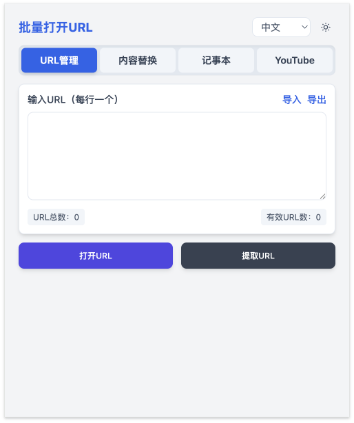

# Open Multiple URLs

一个高效的Chrome扩展，帮助你批量打开和管理多个URL，还包含记事本、内容替换、YouTube搜索等实用功能。

## 📸 界面预览



*主要功能界面展示*

## ✨ 功能特点

### 🔗 URL管理
- 🚀 批量打开多个URL
- 🔄 支持多种打开顺序（正常、反向、随机）
- 👥 自动创建标签页分组
- 🎯 智能URL提取功能
- 🔍 支持从文本中提取URL

### 📝 记事本功能
- ✏️ 创建、编辑、删除记事
- 🔍 支持记事搜索
- 💾 本地存储，数据持久化
- ⏰ 自动保存功能
- 📅 显示创建和修改时间
- 🎨 锤子便签风格的简洁界面

### 🔄 内容替换
- 🔍 查找和替换文本内容
- 📋 支持复制替换后的内容
- ⚡ 快速替换和全部替换功能

### 🎥 YouTube功能
- 🔍 YouTube视频搜索
- 🎬 新窗口播放视频
- 🔑 支持自定义API密钥
- 💾 搜索结果缓存机制

### 🎨 界面设计
- 🎨 简洁美观的用户界面
- 🌙 支持深色模式
- 🌍 国际化支持（中文/英文）
- 📱 响应式设计

### 🔒 隐私保护
- 🔒 所有数据本地处理
- 🚫 不收集任何个人信息
- 🛡️ 不使用任何跟踪机制

## 📦 安装

1. 从Chrome网上应用店安装（即将上线）
2. 或者手动安装：
   - 下载此仓库的代码
   - 打开Chrome，进入扩展程序页面（chrome://extensions/）
   - 开启"开发者模式"
   - 点击"加载已解压的扩展程序"

## 🚀 使用说明

### URL管理
1. 点击浏览器工具栏中的扩展图标
2. 在"URL管理"标签页中输入要打开的URL（每行一个）
3. 点击"打开URL"按钮

### 记事本
1. 切换到"记事本"标签页
2. 点击"新建记事"创建新记事
3. 在编辑界面输入标题和内容
4. 支持搜索和编辑现有记事

### 内容替换
1. 切换到"内容替换"标签页
2. 在"原内容"中输入要处理的文本
3. 在"查找内容"和"替换为"中输入替换规则
4. 点击"替换"或"全部替换"

### YouTube搜索
1. 切换到"YouTube"标签页
2. 输入搜索关键词
3. 点击搜索结果中的视频在新窗口播放

## 🔒 隐私政策

我们非常重视用户隐私，本扩展：
- 所有数据本地处理，不会上传到任何服务器
- 不收集任何个人信息
- 不使用任何跟踪机制

详细信息请查看[隐私政策](privacy-policy.md)。

## 🤝 贡献

欢迎提交问题和改进建议！如果你想贡献代码：

1. Fork 这个仓库
2. 创建你的特性分支 (`git checkout -b feature/AmazingFeature`)
3. 提交你的改动 (`git commit -m 'feat: 添加令人惊叹的新功能'`)
4. 推送到分支 (`git push origin feature/AmazingFeature`)
5. 开启一个 Pull Request

### Commit Message 格式

我们使用以下格式规范commit message：

```
<type>: <description>

[optional body]
[optional footer]
```

常用的type类型：
- feat: 新功能
- fix: 修复bug
- docs: 文档更新
- style: 代码格式调整
- refactor: 代码重构
- test: 测试相关
- chore: 构建过程或辅助工具的变动

## 📄 许可证

本项目采用 MIT 许可证 - 查看 [LICENSE](LICENSE) 文件了解详细信息

## 👨‍💻 作者

[ahkjxy](https://github.com/ahkjxy)